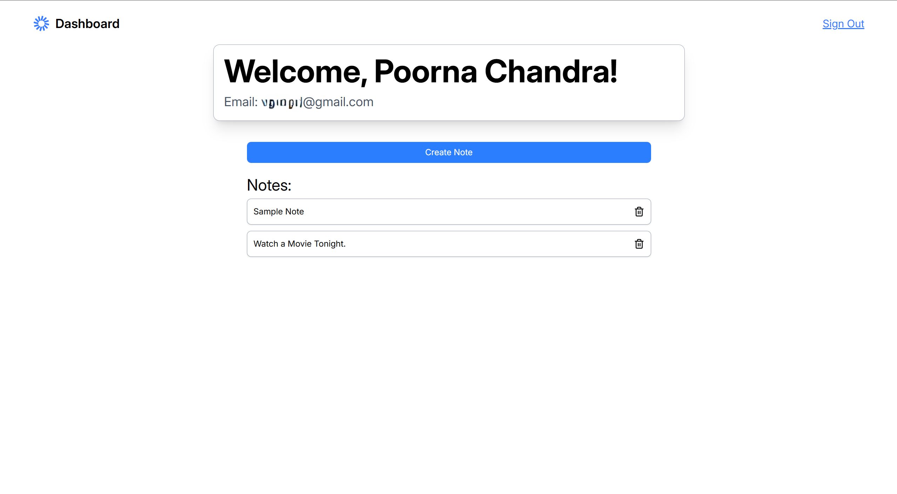
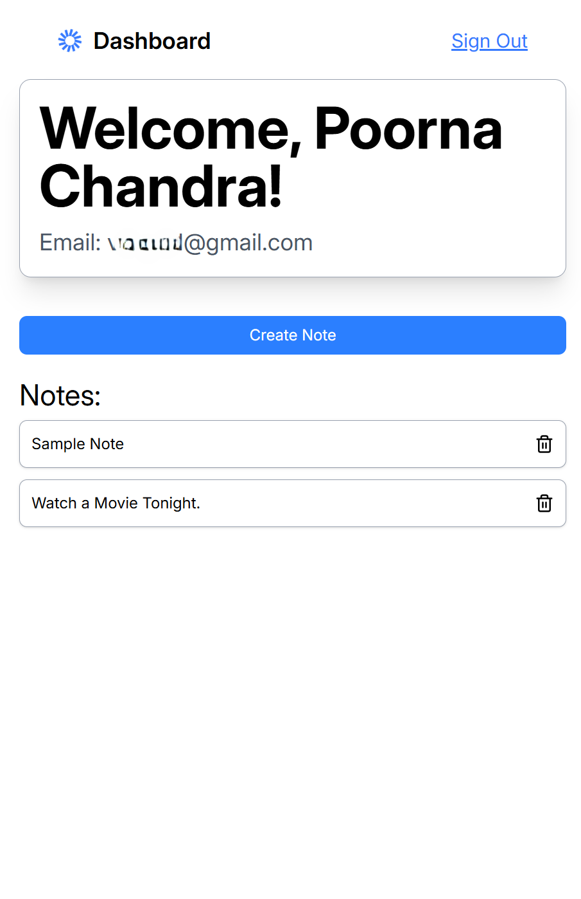
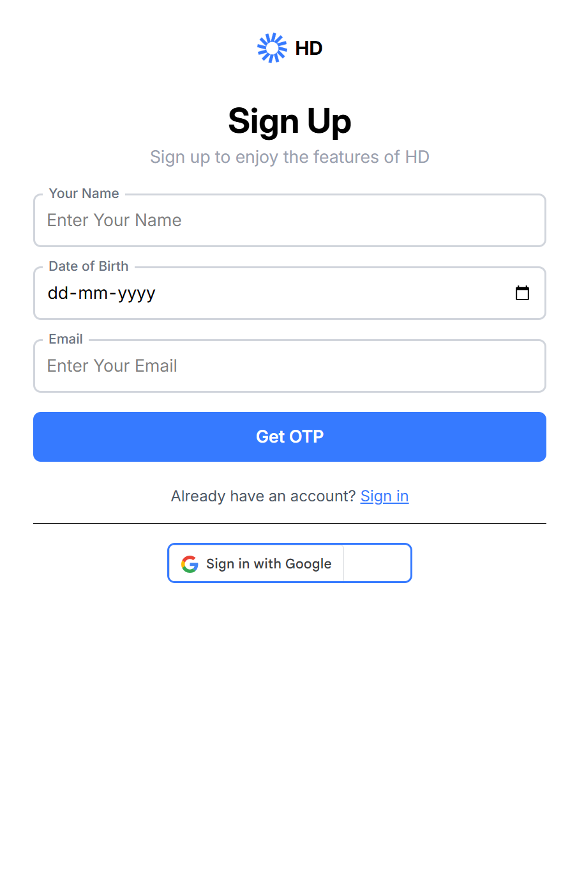

# 📒 HD Note Taking App

A full-stack note-taking application built with **React (TypeScript)** for the frontend,  
**Node.js + Express (TypeScript)** for the backend, and **MongoDB** as the database.  

✅ Features:
- Sign up with **Email + OTP** or **Google OAuth**  
- Login with Email OTP or Google  
- JWT-based authentication  
- Create and delete personal notes  
- Protected dashboard showing user info (name, email, notes)  
- Mobile-friendly UI  

---

## 🚀 Demo

You can Access Live Demo of the Project Here 👉 [https://note-taking-app-hd.vercel.app/](https://note-taking-app-hd.vercel.app/)  


---

## 📂 Project Structure

```
root/ 
├── backend/   # Node.js + Express + TypeScript server 
├── frontend/  # React + TypeScript client (Vite) 
├── README.md  # Project docs   
```


---

## ⚡ Tech Stack

- **Frontend:** React (TypeScript), Vite, Axios, TailwindCSS  
- **Backend:** Node.js, Express.js, TypeScript, JWT, Google OAuth, Nodemailer (email OTP)  
- **Database:** MongoDB (Mongoose ORM)  
- **Auth:** OTP (Email) + Google Sign-In  
- **Deployment:** Vercel (frontend), Render (backend)  

---

## 🛠️ Setup Instructions (Local Development)

### 1. Clone repo
```bash
git clone https://github.com/Poorna-Chidipothu/Note-Taking-App.git
cd Note-Taking-App
```

### 2. Backend Setup

```bash
cd Backend
npm install
cp .env.example .env   # update values for MongoDB, JWT_SECRET, Google OAuth, (Email, Pass) for Nodemailer
npm run build
npm start
```

Runs backend on http://localhost:4000

### 3. Frontend Setup
```bash
cd Frontend
npm install
npm run dev
```
Runs frontend on http://localhost:5173


---
## 🔑 Environment Variables
> [!NOTE]  
> Make sure to Update the environment variable of Your Own

### Backend ``.env``
```
MONGO_URI=mongodb://localhost:27017/noteapp
JWT_SECRET=your_jwt_secret_here
GOOGLE_CLIENT_ID=***************.apps.googleusercontent.com
EMAIL_USER=you@example.com
EMAIL_PASS=yourpassword
```


### Frontend ``.env``

```
VITE_GOOGLE_CLIENT_ID=***************************.apps.googleusercontent.com
VITE_API_BASE_URL=https://you-hosted-url/api
```

---
## 📸 Screenshots


  



 

